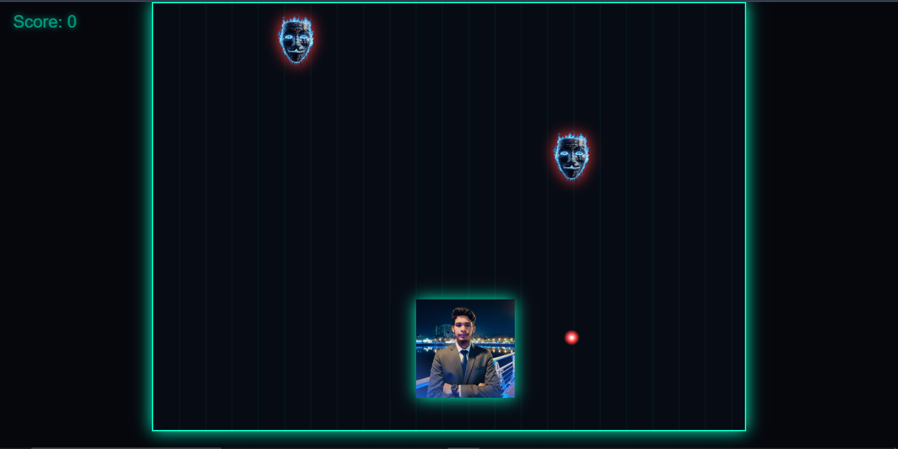
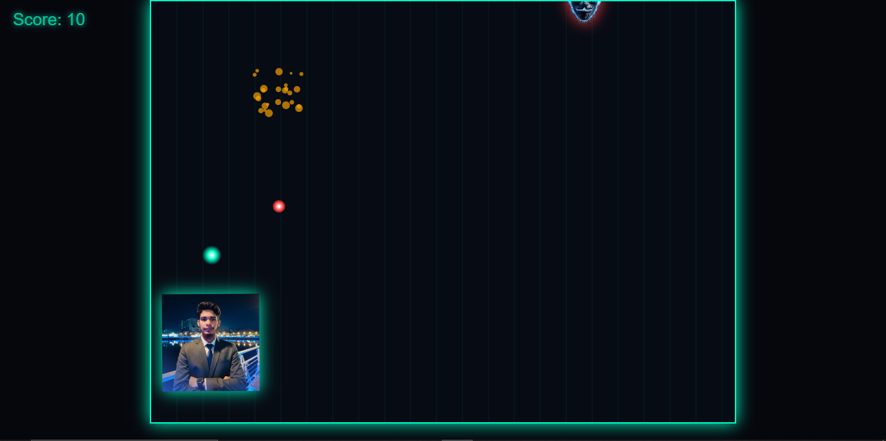
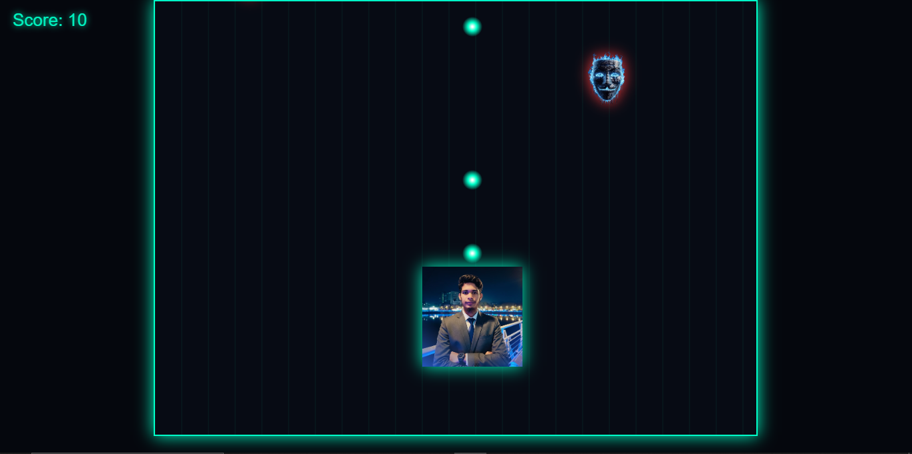
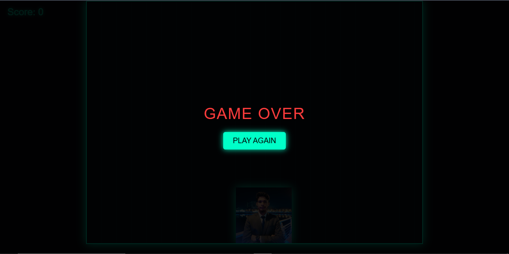

### Uplode date: 01 March 2026 at 2:20 Am
---
# Neon War: Mini Military Game









**Neon War** is a browser-based mini military shooter game built with **HTML5**, **CSS3**, and **JavaScript**. Players control a neon spaceship, dodge enemy fire, and shoot down enemies in a fast-paced, visually immersive neon environment.

---

## 🎮 Features

- Smooth player movement with keyboard controls (Arrow keys / WASD)
- Interactive shooting mechanics with glowing bullets
- Enemy AI with random spawning and firing patterns
- Explosive particle effects for hits and collisions
- Score tracking and a polished game-over screen
- Neon-themed visuals with dynamic glow effects
- Fully responsive and playable in modern browsers

---

## 🕹️ How to Play

1. Open `index.html` in any modern web browser.
2. Move your spaceship using **Arrow keys** or **WASD**.
3. Press **Spacebar** to shoot bullets.
4. Destroy enemies to earn points.
5. Avoid enemy bullets. If hit, the game ends.
6. Press **PLAY AGAIN** to restart the game.

---

## ⚡ Technologies Used

- **HTML5 Canvas** for rendering
- **JavaScript** for game logic and interactivity
- **CSS3** for neon UI and animations

---

## 📁 File Structure
```
 |game.html-----open this file any browser
 |---funtion.js
 |---ac.css
 |===========
 |---redme.md
 |---demo png
```
---
